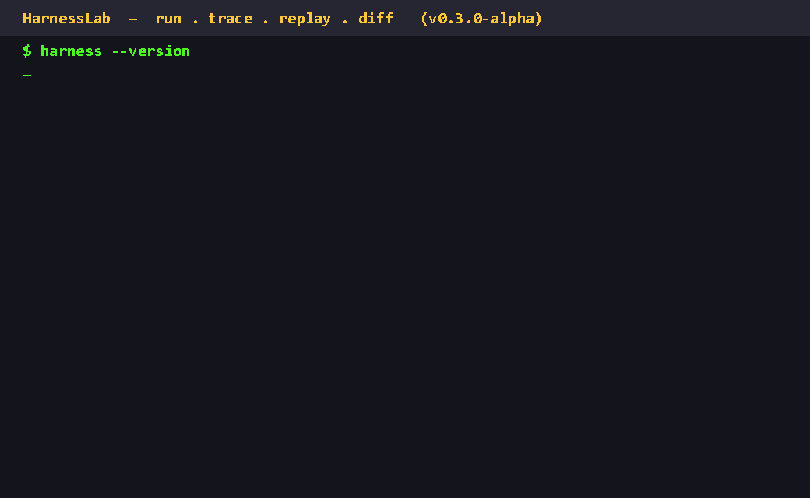

# HarnessLab

**Build. Trace. Replay. Benchmark. Evolve.**

An open-source Go platform for **AI Agent Harness Engineering**.

> **Same model. Same task. Same repository. Different harness.**
>
> HarnessLab turns the hard-coded parts of a coding agent — prompt, context,
> planning, tools, verification, retry, budget — into a configurable,
> observable, reproducible, comparable and optimizable **harness**.

[](https://github.com/ittakestwo123/Harnesslab/actions/workflows/ci.yml)
[](https://go.dev)
[](LICENSE)
[](https://github.com/ittakestwo123/Harnesslab/releases)

---

## Demo



**Replay a coding-agent run without calling the model API.**

```text
Live Run        ~4s     (real DeepSeek model + tools)
Offline Replay  16ms    (all model + tool calls served from the store)
External Calls  0
Verification    PASS    (recorded workspace changes re-applied)
```

## Why HarnessLab?

Model quality gets all the attention, but the **harness** around the model —
prompt, planning, context, tools, verification, retry, budget — decides how
well the model performs in practice. HarnessLab makes harness changes
**measurable**:

- **Replay** — re-run any recorded agent run offline in milliseconds, no API
  key, no cost ([docs/replay.md](docs/replay.md))
- **Diff** — same task, two harnesses: aligned trajectory + first divergence
- **Benchmark** — 34 real tasks × 8 categories × dev/holdout × repeated runs,
  with per-variant statistics and confidence intervals
  ([docs/benchmark.md](docs/benchmark.md))
- **Optimize** — failure analysis → LLM-generated harness candidates → dev
  evaluation → Pareto selection → holdout validation with a reject gate
  ([docs/optimizer.md](docs/optimizer.md))
- **Reproduce** — `.harness` bundles + environment fingerprint validation
  ([docs/reproducibility.md](docs/reproducibility.md))

## Quick start

```bash
# 1. Install: download a binary from Releases, or
go build -o harness ./cmd/harness

# 2. Configure your LLM
export DEEPSEEK_API_KEY=sk-...        # or OPENAI_API_KEY (provider: openai)

# 3. Initialize a harness and run a task
harness init                          # creates .harness/harness.yaml
harness run "fix the failing parser tests" --repo https://github.com/octocat/Hello-World.git
```

A few commands into the workflow:

```bash
harness runs                          # list recorded runs
harness trace <run-id>                # render the trajectory
harness replay <run-id>               # offline replay (free, no API)
harness diff <run-a> <run-b>          # compare two runs
harness bench benchmarks/tasks --config benchmarks/harness.yaml --matrix benchmarks/matrices/harness-ablation.yaml
```

## Features

- **HarnessSpec** — `harness.yaml`: planning, context (repo-map), skills,
  tools, verification, retry, sandbox, budget, pricing
- **Runtimes** — tRPC-Agent-Go (default) and Codex CLI behind one
  runtime-agnostic interface ([docs/runtimes.md](docs/runtimes.md))
- **Trace / Replay / Diff** — full trajectory recording, offline replay,
  trajectory comparison ([docs/replay.md](docs/replay.md))
- **Benchmark v3** — 34 tasks, 8 categories, dev/holdout, `--repeat N`,
  statistical reports, H0–H6 harness ablation
  ([docs/benchmark.md](docs/benchmark.md))
- **Sandbox** — `none` / `process` / `docker` / `bwrap` for agent commands and
  verification ([docs/sandbox.md](docs/sandbox.md))
- **Cost & budget** — per-run `CostUSD` from a pricing table; token/cost/time
  budgets per run
- **Reproduce** — snapshot / export / reproduce with environment validation
  ([docs/reproducibility.md](docs/reproducibility.md))
- **LLM Harness Optimizer** — dev → Pareto → holdout loop with a
  Dev-only-win REJECT gate ([docs/optimizer.md](docs/optimizer.md))

## Public benchmark

**34 real coding tasks in 8 categories** against the seeded
`bench/tasks-v2` commit `075550a` (4 intentional regressions caught by failing
tests + 2 doc typos), dev 25 / holdout 9, H0–H6 ablation, repeated runs and
statistical reporting. Every PASS comes from real verification —
**hallucination != pass**.

```bash
harness bench benchmarks/tasks --config benchmarks/harness.yaml --matrix benchmarks/matrices/harness-ablation.yaml --set dev --repeat 2
```

See [benchmarks/README.md](benchmarks/README.md) and
[docs/benchmark.md](docs/benchmark.md).

> **Previous benchmark (v0.2, historical):** 10 tasks × 4 variants = 40 runs,
> 39/40 passes, USD 0.38 total (2026-08-16) —
> [benchmarks/results/README.md](benchmarks/results/README.md).

## Status

Current release: **v0.3.1-alpha** (previous: v0.3.0-alpha).

HarnessLab currently includes:

- tRPC-Agent-Go runtime
- Codex CLI runtime
- Offline model/tool replay
- Trajectory diff
- 34-task Benchmark v3
- 8 benchmark categories
- Dev / holdout task split
- Repeated benchmark runs
- Statistical reporting
- Harness H0–H6 ablation
- Git worktree isolation
- Process / Docker / bwrap sandbox
- Model cost accounting
- Reproducibility bundles
- Environment validation
- LLM harness candidate generation
- Dev → Pareto → Holdout optimizer pipeline

## CLI reference

| Command | Description |
| --- | --- |
| `harness init` | Generate a `.harness/` directory with a default `harness.yaml` |
| `harness run "<task>"` | Run an agent with a harness, stream progress, verify, persist |
| `harness trace <run-id>` | Render a run's trajectory |
| `harness runs` | List recorded runs |
| `harness replay <run-id>` | Offline replay from the recorded replay store |
| `harness diff <run-a> <run-b>` | Metrics table + aligned trajectory + first divergence |
| `harness bench <tasks>` | Benchmark tasks x harness variants (worker pool, budgets) |
| `harness snapshot` | Write `.harness/harness.lock` for the current harness |
| `harness export <run-id>` | Export a reproducible `.harness` bundle |
| `harness reproduce <run-id\|bundle>` | Re-run offline from recorded spec + replay store |
| `harness optimize` | Failure analysis, LLM candidate generation (`--llm`), dev/Pareto/holdout evaluation (`--evaluate`) |

## Documentation

- [Architecture](docs/architecture.md)
- [Benchmark](docs/benchmark.md)
- [Offline replay](docs/replay.md)
- [Runtimes](docs/runtimes.md)
- [Sandbox](docs/sandbox.md)
- [Reproducibility](docs/reproducibility.md)
- [LLM Harness Optimizer](docs/optimizer.md)
- [Runnable demos](docs/demo.md)
- [Community launch materials](docs/announcement.md)

## Contributing

See [CONTRIBUTING.md](CONTRIBUTING.md). Bug reports and feature requests go
through the [issue templates](.github/ISSUE_TEMPLATE/); code changes through
pull requests with the checklist in [PULL_REQUEST_TEMPLATE.md](.github/PULL_REQUEST_TEMPLATE.md).

## License

Apache-2.0. See [LICENSE](LICENSE) and [NOTICE](NOTICE).
